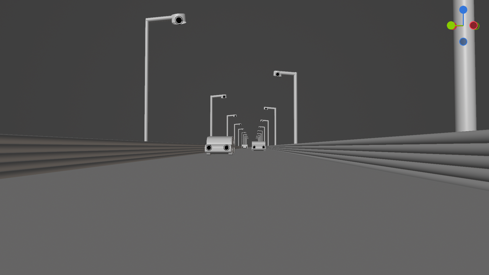
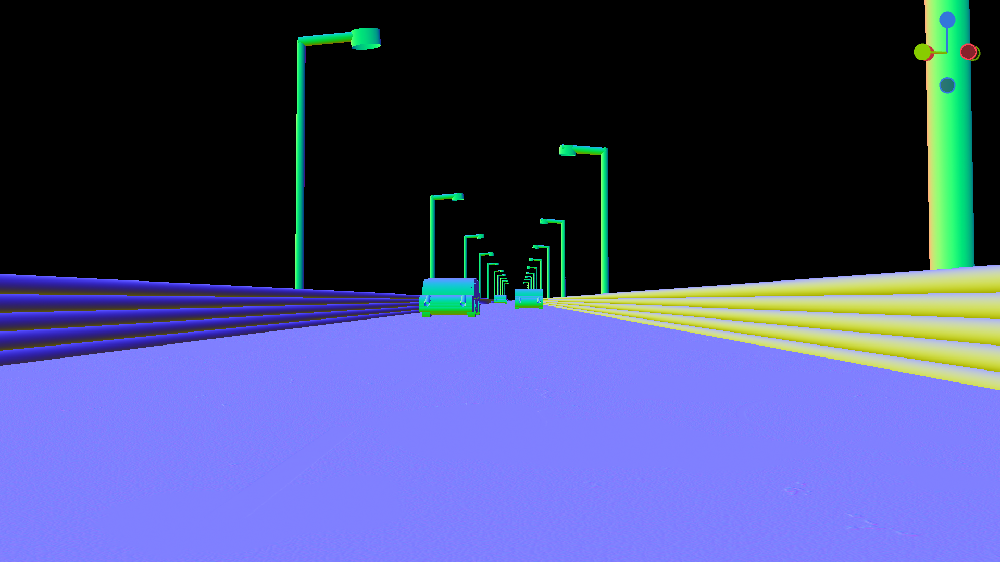

# Description

This project started out as a team project at [42 Heilbronn Coding School](https://www.42heilbronn.de/) together with [nmihaile](https://github.com/nmihaile).
While the original subject asks for a simple CPU Raytracer, we wanted to learn more about graphics programming and try to create something more complex with openGL for the GPU.

# Features

- HDRi Enviromnemnt Maps illuminate the scene using multiple importance sampling.
- Material properties (Roughness, Metallic, Base Color) can be values or textures
- Normal Maps
- Point Lights (with radius)
- Primitives: Sphere, Cylinder, Plane and Hyperboloid

  [*primitives.rt image*]
- AgX color view transform (I created my own 3D LUT using Blender)

  [*raw vs agx images*]
- Reflections and Bounce Light (glossy/diffuse bounces)
  

	  
	   
	  
  

- Viewport Shading Modes: Render, Solid and Normal (with Blender-like Gizmo showing orientation)
  

	  
	   
	  
  

- Adaptive renderscale during viewport navigation

  [*gif/video showing viewport navigation*]

# Renders

# Comparing with Blender Cycles

### Roughness from `0.0` to `1.0`

	Cycles 
	
	
	
	
	
	
	 miniRT‎ 
	
	
	
	
	
	

 

### Metallic from `0.0` to `1.0`

	Cycles 
	
	
	
	
	
	
	 miniRT‎ 
	
	
	
	
	
	

 

### IOR (Index of Refraction) from `1.0` to `2.0`

	Cycles 
	
	
	
	
	
	
	 miniRT‎ 
	
	
	
	
	
	

