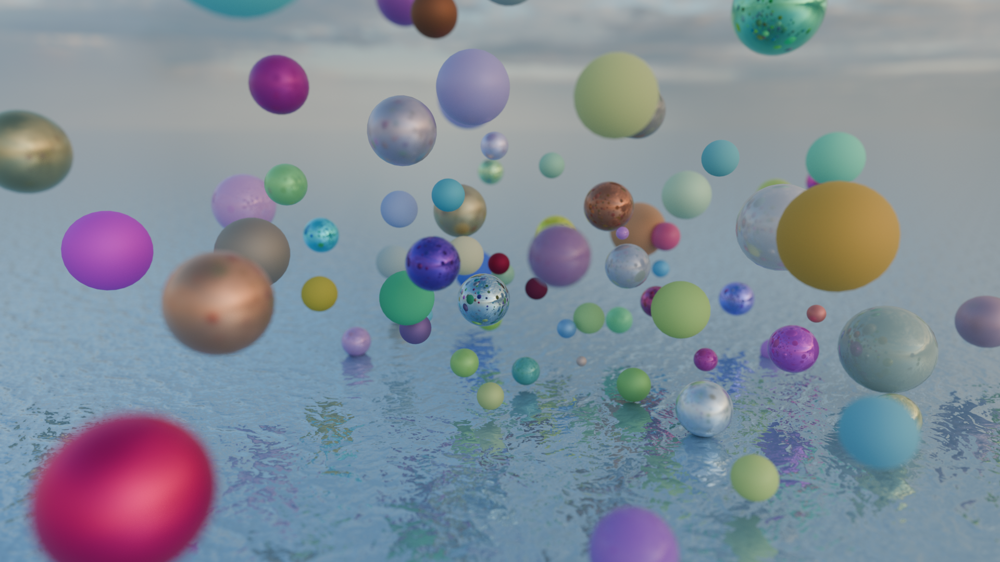

# Contents

[Introduction](#introduction) \
[Features](#features) \
[Rendered Scenes](#rendered-scenes) \
[Dependencies](#dependencies) \
[Installation](#installation) \
[Usage](#usage) \
[Controls](#controls) \
[Scene file format](#scene-file-format) \
[Assets](#assets)

# Introduction

This project started out as a team project at [42 Heilbronn Coding School](https://www.42heilbronn.de/) together with [nmihaile](https://github.com/nmihaile).
While the original subject asks for a simple CPU Raytracer, we wanted to learn more about graphics programming and try to create something more complex with openGL for the GPU.

After concluding the team project, I continued to work on making it more physically accurate using [Blender](https://www.blender.org) [Cycles](https://www.blender.org/features/rendering/) as a reference, restructure things, add more features and create new scenes. I probably spent the most time on my multiple importance sampling implementation for the HDRi environment maps. It's capable of rendering nice looking scenes, but it's very much a naive and hacky implementation. The same goes for many of the more complex parts of the program, but I'm happy with how it turned out in the end and looking forward to learn more in the future.

# Features

- HDRi Enviromnemnt Maps illuminate the scene using multiple importance sampling.
- Material properties (Roughness, Metallic, Base Color) can be values or textures
- Normal Maps
- Point Lights (with radius)
- Primitives: Sphere, Cylinder, Hyperboloid and Plane
	<br><br>
	
	<br><br>
- Reflections and Bounce Light (glossy/diffuse bounces)
	<br><br>
	
	 
	
	<br><br>
- AgX color mapping (I created my own 3D LUT using Blender)
	<br><br>
	
	 
	
	<br><br>
- Viewport Shading Modes: Render, Solid and Normal (with Blender-like Gizmo)
	<br><br>
	
	 
	
	<br><br>
- Adaptive renderscale during viewport navigation to ensure smooth FPS
	<br><br>
	
	<br><br>


# Rendered Scenes

`road.rt`\


`metal.rt`\


`ocean.rt`\


`poker.rt`\


`poker2.rt`\


`wireframe_cube.rt`\


`infinity_mirror.rt`\


`random_materials.rt`\


`rainbow.rt`\


`checkerboard.rt`\


`soft_light.rt`\


`caleidoscope.rt` \
 \
&nbsp;&nbsp;&nbsp;( *hold <kbd>↑</kbd> to animate* )
<br><br>

# Comparing with Blender Cycles

left is Cycles, right is miniRT

            
   
 

<br>

### Roughness from `0.0` to `1.0`
Cycles<br>


<br>
miniRT<br>


<br><br>

### Metallic from `0.0` to `1.0`
Cycles<br>


<br>
miniRT<br>


<br><br>

### IOR (Index of Refraction) from `1.0` to `2.0`
Cycles<br>


<br>
miniRT<br>


<br><br>

# Dependencies

#### Debian / Ubuntu
```
sudo apt update
sudo apt install build-essential libx11-dev libglfw3-dev libglfw3 xorg-dev
```

#### Arch (x11)
```
sudo pacman -S glfw-x11
```

#### Arch (wayland)
```
sudo pacman -S glfw-wayland
```

#### MacOS
```
brew install glfw
```

# Installation

```
git clone https://github.com/bewerner/miniRT.git
cd miniRT
make
```

# Usage

```
./miniRT path_to_scene_file.rt
```

# Controls

### Movement

| ⠀⠀⠀⠀⠀⠀⠀⠀⠀⠀Key⠀⠀⠀⠀⠀⠀⠀⠀⠀⠀                                     | ⠀⠀⠀⠀⠀⠀⠀⠀⠀⠀⠀⠀⠀⠀⠀⠀Description⠀⠀⠀⠀⠀⠀⠀⠀⠀⠀⠀⠀⠀⠀⠀⠀           |
|----------------------------------------------------------------|-----------------------------------------------------------|
| <kbd>W</kbd>, <kbd>A</kbd>, <kbd>S</kbd>, <kbd>D</kbd>         | Move around                                               |
| <kbd>E</kbd> or <kbd>Space</kbd>                               | Move up                                                   |
| <kbd>C</kbd> or <kbd>Shift</kbd>                               | Move down                                                 |
| <kbd>Right Mouse Button</kbd> and drag                         | Look around                                               |
| <kbd>Scroll Wheel up/down</kbd>                                | Increase/decrease movement speed                          |
| <kbd>M</kbd>                                                   | Toggle mouse input (if there are issues)                  |

### Camera

| ⠀⠀⠀⠀⠀⠀⠀⠀⠀⠀Key⠀⠀⠀⠀⠀⠀⠀⠀⠀⠀                                     | ⠀⠀⠀⠀⠀⠀⠀⠀⠀⠀⠀⠀⠀⠀⠀⠀Description⠀⠀⠀⠀⠀⠀⠀⠀⠀⠀⠀⠀⠀⠀⠀⠀           |
|----------------------------------------------------------------|-----------------------------------------------------------|
| <kbd>F</kbd>                                                   | Toggle depth of field                                     |
| <kbd>R</kbd>                                                   | Reset camera view                                         |
| <kbd>Numpad 1</kbd>, <kbd>Numpad 3</kbd>, <kbd>Numpad 7</kbd>  | Axial view                                                |
| <kbd>P</kbd>                                                   | Print camera info                                         |

### General

| ⠀⠀⠀⠀⠀⠀⠀⠀⠀⠀Key⠀⠀⠀⠀⠀⠀⠀⠀⠀⠀                                     | ⠀⠀⠀⠀⠀⠀⠀⠀⠀⠀⠀⠀⠀⠀⠀⠀Description⠀⠀⠀⠀⠀⠀⠀⠀⠀⠀⠀⠀⠀⠀⠀⠀           |
|----------------------------------------------------------------|-----------------------------------------------------------|
| <kbd>Tab</kbd>                                                 | Cycle through shading modes (Render, Solid, Normal)       |
| <kbd>V</kbd>                                                   | Cycle through color view transforms (AgX, Standard, Raw)  |
| <kbd>G</kbd>                                                   | Toggle gizmo in render mode                               |
| <kbd>I</kbd> / <kbd>K</kbd>                                    | Increase/decrease render scale                            |
| <kbd>O</kbd>                                                   | Save screenshot                                           |
| <kbd>Esc</kbd>                                                 | Quit                                                      |


# Scene file format

The `.rt` scene file format describes the scene with identifiers followed by their specific parameters.
Parameters and sections marked with `*` are optional.

Positions and directions are specified as `vec3`. (X/Y/Z values as floats) \
Colors are generally specified as `u8vec3` (R/G/B values beween 0-255). \
Some color parameters can alternatively be mapped to a `texture`. \
Others are specified as `float` or `int`.

### Camera

```
ID    position    view-direction    field of view (horizontal)    f-stop*    focus-distance*
C     vec3        vec3              float                         float      float
```

### Ambient

Single color ambient or HDRi environment map
```
ID    strength    color
A     float       u8vec3/filepath_to_environment_map.hdr
```

### Point light

```
ID    position    power (in watts)    color     radius*
l     vec3        float               u8vec3    float
```

### Render settings

```
ID    max diffuse bounces    max glossy bounces    max_samples*
R     int                    int                   int
```

### Window size

```
ID    width    height
W     int      int
```

### Textures

There are two types of textures: image texture and 3D checkerboard texture. \
Images textures are limited to 10 per scene and overall textures are limited to 100 per scene. \
Textures are defined with the `tex` identifier and can be referenced by their `name` in any `material`.

### Image texture
```
ID     name        type     path
tex    any_name    image    filepath_to_image_file
```

### Checker texture
```
ID     name        type       scale    color_1    color_2
tex    any_name    checker    float    u8vec3     u8vec3
```

### Materials

Materials are defined with the `mat` identifier and can be referenced by their `name` in any `object`. \
Materials are limited to 100 per scene. \
**Transmission is not implemented**. It does nothing, but a value has to be provided. \
Emission is not really properly implemented but it has an effect.

### Material
```
ID     name        base color        metallic          roughness         IOR      transmission    emission_strength    emission_color
mat    any_name    u8vec3/texture    u8vec3/texture    u8vec3/texture    float    float           float                u8vec3
```

### Primitives

If a primitive has no material, a default material will be used.
If a primitive has no color, it's material color will be used.
UV-scale takes one float to uniformly scale the UV **or** a vec2 to scale width and height individually.

### Plane
```
ID    origin    normal    color*    material*    uv-scale*
pl    vec3      vec3      u8vec3    material     float/vec2
```

### Sphere
```
ID    origin    diameter    color*    material*    uv-scale*
sp    vec3      flaot       u8vec3    material     float/vec2
```

### Cylinder
```
ID    origin    orientation    diameter    height    color*    material*    uv-scale*
cy    vec3      vec3           float       float     u8vec3    material     float/vec2
```

### Hyperboloid
```
ID    origin    orientation    height    a        b        c        shape    color*    material*    uv-scale*
hb    vec3      vec3           float     float    float    float    float    u8vec3    material     float/vec2
```

I also included the [Blender Python Script](resources/rt_export_script_v004.py) I used to create these scenes in Blender and export them into the .rt file format. It's incomplete though and still requires some manual edits and additions. To use it, change the `output_file_path` on top.

# Assets

### HDRi Environment Maps

from [Poly Haven](https://polyhaven.com/):
- [Brown Photostudio 02](https://polyhaven.com/a/brown_photostudio_02)
- [Evening Road 01 (Pure Sky)](https://polyhaven.com/a/evening_road_01_puresky)
- [Shanghai Bund](https://polyhaven.com/a/shanghai_bund)
- [Sunflowers (Pure Sky)](https://polyhaven.com/a/sunflowers_puresky)
- [Syferfontein 18d Clear](https://polyhaven.com/a/syferfontein_18d_clear)

### PBR Material Textures

from [ambientCG](https://ambientcg.com/):
- [Diamond Plate 003](https://ambientcg.com/view?id=DiamondPlate003)
- [Fabric 032](https://ambientcg.com/view?id=Fabric032)
- [Metal 047 B](https://ambientcg.com/view?id=Metal047B)
- [Tiles 074](https://ambientcg.com/view?id=Tiles074)
- [Wood 067](https://ambientcg.com/view?id=Wood067)

from [3D Textures](https://3dtextures.me/):
- [Metal Plate 021](https://3dtextures.me/2019/06/18/metal-plate-021/)
- [Water 001](https://3dtextures.me/2017/12/28/water-001/)

from [cgbookcase](https://www.cgbookcase.com/)
- [Two Lane Road Wet 01](https://www.cgbookcase.com/textures/two-lane-road-wet-01)

from [Free PBR](https://freepbr.com/)
- [White Plain Paper](https://freepbr.com/product/white-plain-paper-pbr/)
