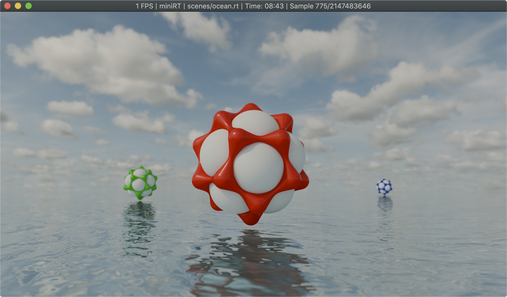

# Contents

[Introduction](#introduction) \
[Features](#features) \
[Rendered Scenes](#rendered-scenes) \
[Dependencies](#dependencies) \
[Installation](#installation) \
[Usage](#usage) \
[Controls](#controls) \
[Scene format](scene-format) \
[Assets](#assets)

# Introduction

This project started out as a team project at [42 Heilbronn Coding School](https://www.42heilbronn.de/) together with [nmihaile](https://github.com/nmihaile).
While the original subject asks for a simple CPU Raytracer, we wanted to learn more about graphics programming and try to create something more complex with openGL for the GPU.

After concluding the team project, I continued to work on making it more physically accurate using [Blender](https://www.blender.org) [Cycles](https://www.blender.org/features/rendering/) as a reference, restructure things, add more features and create new scenes. I probably spent the most time on my multiple importance sampling implementation for the HDRi environment maps. It turned out presentable, capable of rendering nice looking scenes, but it's very much a naive and hacky implementation. The same goes for many of the more complex parts of the program, but I'm happy with how it turned out in the end and looking forward to learn more in the future.

# Features

- HDRi Enviromnemnt Maps illuminate the scene using multiple importance sampling.
- Material properties (Roughness, Metallic, Base Color) can be values or textures
- Normal Maps
- Point Lights (with radius)
- Primitives: Sphere, Cylinder, Hyperboloid and Plane
	<br><br>
	
	<br><br>
- AgX color mapping (I created my own 3D LUT using Blender)
	<br><br>
	
	 
	
	<br><br>
- Reflections and Bounce Light (glossy/diffuse bounces)
	<br><br>
	
	 
	
	<br><br>
- Viewport Shading Modes: Render, Solid and Normal (with Blender-like Gizmo)
	<br><br>
	
	 
	
	<br><br>
- Adaptive renderscale during viewport navigation to ensure smooth FPS
	<br><br>
	
	<br><br>


# Rendered Scenes

`road.rt`\


`metal.rt`\


`ocean.rt`\


`poker.rt`\


`poker2.rt`\


`wireframe_cube.rt`\


`infinity_mirror.rt`\


`random_materials.rt`\


`rainbow.rt`\


`checkerboard.rt`\


`soft_light.rt`\


`caleidoscope.rt` \

&nbsp;&nbsp;&nbsp;( *hold <kbd>↑</kbd> to animate* )
<br><br>

# Comparing with Blender Cycles

### Roughness from `0.0` to `1.0`

Cycles<br>


<br>
miniRT<br>


<br>
<br>


### Metallic from `0.0` to `1.0`
Cycles<br>


<br>
miniRT<br>


<br>
<span><br></span>

### IOR (Index of Refraction) from `1.0` to `2.0`
Cycles<br>


<br>
miniRT<br>


<br>
<br>

# Dependencies

#### Debian / Ubuntu
```
sudo apt update
sudo apt install build-essential libx11-dev libglfw3-dev libglfw3 xorg-dev
```

#### Arch (x11)
```
sudo pacman -S glfw-x11
```

#### Arch (wayland)
```
sudo pacman -S glfw-wayland
```

#### MacOS
```
brew install glfw
```

# Installation

```
git clone https://github.com/bewerner/FdF.git
cd FdF
make
```

# Usage

```
./miniRT path_to_scene_file.rt
```

# Controls

# Scene format

The `.rt` scene format describes the scene with identifiers followed by it's specific parameters.
Parameters marked with `*` are optional.

Positions and directions are specified as `vec3`.
Colors can be specified as `u8vec3` (RGB values beween 0-255). Most color parameters can alternatively be mapped to a texture.
Others are specified as `float`.

### Camera

```
id    position    view-direction    field of view (horizontal)    f-stop*    focus-distance*
C     vec3        vec3              float                         float      float
```

### Ambient

```
id    strength    color     
A     float       u8vec3/texture
```

# Assets
